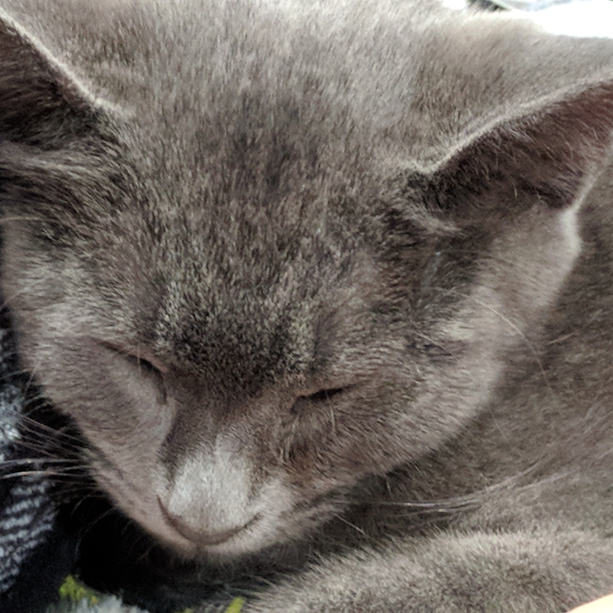

## nixLoki

My neovim config using [Lazy](https://github.com/folke/lazy.nvim) and [nixCats](https://github.com/BirdeeHub/nixCats-nvim).

I did not want to move my neovim config off of Lazy in order to move to nix, nixCats was the compromise using its lazy-wrapper. 

The idea is that on a nix system this flake can be added to the inputs and used
as a package, and on a non-nix systems (could also be done on nix systems, really)
this repo can be cloned into `.config` and used normally.

On a non-nix system, Lazy will handle all plugin downloads as usual and nixCats
will do nothing. Whereas on a nix system, all plugin downloads are handled by nix.
Using the nvim plugins packaged in [nixpkgs](https://github.com/NixOS/nixpkgs) under `vimPlugins`, which most are. Plugins that do not have a nixpkg can be added as well.
and enabled/disabled by nixCats, then the lazy loading and configuration is 
handled by Lazy as usual.

### Configuration
All actual plugin configuration is exactly as it would be on a regular Lazy config.
nixCats is used very occasionally to resolve paths and also to check if a plugin category (cat) is enabled when using nixCats. 

### Adding a Plugin
Plugin specs are added as per usual with Lazy configurations. 
Except the `enabled` field needs to be checked with `nixCatsUtils`

```lua
{
    "the-spec-of/myplugin",
    enabled = require("nixCatsUtils").enableForCategory("myplugin", true)
}
```

The second provided value will be returned by default if nixCats is not active.
If nixCats is active and the specified cat (category) is enabled, then true is 
returned, and false if the cat is unset or set to false.

After the spec is added, a cat should be added to `./cats.nix`, specifying 
its package and any dependencies

```nix
startupPlugins = with pkgs.vimPlugins; {
    myplugin = [
        myplugin-nvim  # whichever name this plugin has in nixpkgs 
        myplugin-dependencies
    ];
};
```

Any plugins that do not have a `nixpkg` can be overlayed on `nixpkgs` in the form `pkgs.neovimPlugins.myplugin`.
This is done by specifying the plugin repo/flake in the flake inputs, with its name set to `plugins-<myplugin-name>`.

```nix
inputs = {
    plugins-myplugin = {  # `plugins-` prefix is how nixCats identifies plugins to be overlayed
        url = "url-to-myplugin-repo";
        flake = false;
    };
};
```

nixCats will then overlay the plugin over `nixpkgs` in the format specified above.

Any dependencies that are not nvim plugins should be specified the same way,
under the same cat but inside `lspsAndRuntimeDeps`, also in `./cats.nix`.

Then enable the cat in `./nvims.nix`. You can enable the cat for a specific
package or add it to the cats shared by all packages.
```nix
loki_cats = {
    myplugin  = true;
};
```
The plugin should be loaded on both nix and non-nix systems 
(except the nix config will need to be rebuilt).


### Packages
This flake currently provides two nix packages, nixLoki and testNixLoki.
They are identical, save for the fact that testNixLoki looks in the directory
`~/.config/testLoki/` for its configuration. The plugins are still managed by
nix however, the lua configuration is not sourced from the nix store as with
nixLoki. This can be useful for testing lua configuration before rebuilding the
packages. Any change to the nix configuration, however, such as adding new 
packages, will require a rebuild.

### Overlays
This flake provides two overlays on nixpkgs, nixLoki(default) and testNixLoki.

### Thanks Loki!!

